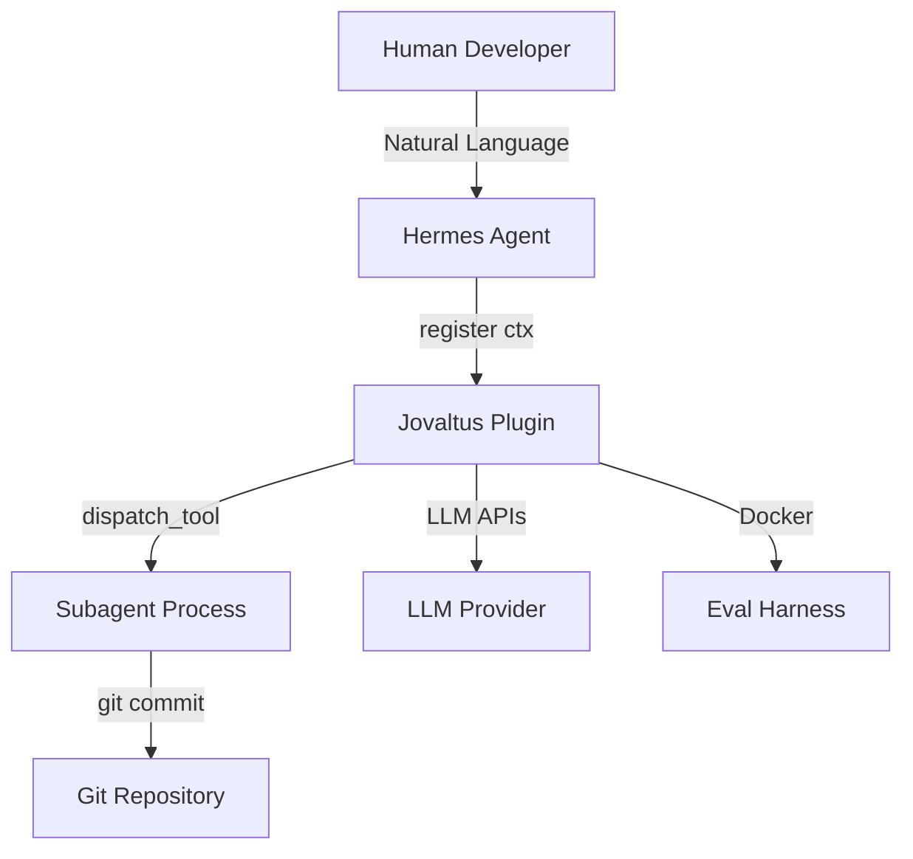
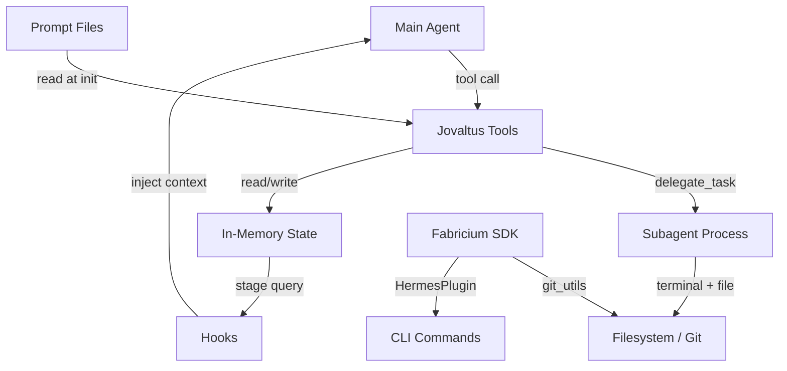

# Architecture — Jovaltus

Jovaltus is a Hermes plugin that implements a 4-phase automated development pipeline
(Plan → Implement → Verify → Simplify) by spawning isolated subagents for each phase
and tracking progress via an in-memory stage machine.

## System Context (C4 Level 1)



**Users:** Human developers interacting with Hermes agent (chat).

**External services:**

| Service | Purpose | Protocol |
|---------|---------|----------|
| Hermes Agent Runtime | Host process; calls `register(ctx)` at startup | Python in-process |
| LLM Provider | Powers subagent reasoning (Claude, DeepSeek, etc.) | HTTP API |
| Git Repository | Source of truth for code changes; subagents commit here | git CLI |
| Docker | Isolated environment for eval harness | Docker API |

## Container View (C4 Level 2)



| Container | Technology | Purpose |
|-----------|-----------|---------|
| Jovaltus Tools | Python closures (factory pattern) | Validate pipeline stage, spawn subagents |
| Subagent Process | Hermes `delegate_task` | Isolated execution: implement/verify/simplify |
| In-Memory State | `threading.Lock`-protected dict | Task records + stage machine |
| Hooks | `post_tool_call` + `pre_llm_call` | Stage tracking + guidance injection |
| Prompt Files | Markdown in `prompts/` | Subagent system prompts loaded at handler creation |
| Fabricium SDK | `fabricium` pkg | `git_utils` (git ops), `HermesPlugin` (CLI + skills) |

## Pipeline Stage Machine

```
idle → implement → verify → simplify → done
  ↑        ↓           ↓          ↓        │
  └────────┴───────────┴──────────┴────────┘
           (any stage can reset to idle)
```

| Stage | Trigger Tool | Next Stage | Subagent Tools |
|-------|-------------|------------|----------------|
| implement | `jovaltus_implement` | verify | terminal, file |
| verify | `jovaltus_verify` | simplify | terminal, file, computer_use |
| simplify | `jovaltus_simplify` | done | terminal, file |

**Dual mode:** `jovaltus_verify` and `jovaltus_simplify` also support stateless
commit-based invocation via `before`/`after` parameters, bypassing the stage machine.

## Data Flow

### Task ID Mode (Stateful Pipeline)

1. User confirms requirements (Phase 0)
2. Main agent calls `jovaltus_implement(plan=...)` → handler:
   - Validates no active task (or stage idle/done)
   - Records `start_hash` + `task_id`
   - Spawns implement subagent with plan context
   - `post_tool_call` hook sets stage to `implement`
3. Main agent calls `jovaltus_verify(task_id=...)` → handler:
   - Validates stage is `implement`
   - Computes `start_hash..HEAD` diff
   - Spawns verify subagent with diff context
4. Main agent calls `jovaltus_simplify(task_id=...)` → handler:
   - Validates stage is `verify`
   - Spawns simplify subagent with diff context
5. `pre_llm_call` hook injects stage banner before each LLM turn

### Commit Mode (Stateless)

1. Main agent calls `jovaltus_verify(before=<hash>)` or `jovaltus_simplify(before=<hash>)`
2. Handler computes `before..HEAD` diff directly
3. Spawns subagent with diff context — no state lookup, no stage validation

## Key Architectural Decisions

| Decision | Rationale | Status |
|----------|-----------|--------|
| Handler factories create closures | `register()` captures `ctx`, avoids class instances | Active |
| Dual-mode tools (task_id + commit) | Pipeline for structured workflows; commit mode for ad-hoc review | Active |
| In-memory state with `threading.Lock` | Plugin instances are single-process; no persistence needed | Active |
| Subagent prompts as Markdown files | Editable without touching Python; loaded at factory creation time | Active |
| Self-bootstrap fabricium on import | Hermes may recreate venv, dropping plugin deps; repair on first import | Active |
| Hooks for soft enforcement (not forced) | Agent always knows its stage but can override; avoids fighting the LLM | Active [INFERRED] |
| Fabricium for git + CLI infrastructure | Avoids duplicating git wrappers and CLI registration in every Hermes plugin | Active |

## Deployment

Jovaltus is distributed as a pip-installable Hermes plugin via PyPI (trusted publisher).
No Docker image, no server — just a Python package.

```
CI/CD → git tag → PyPI trusted publisher → pip install jovaltus
```

`hermes jovaltus setup` creates the `jovaltus-agent` profile, installs bundled skills,
and optionally applies `SOUL.md`.

## How to Update

- New pipeline stage? → Update stage machine diagram + `state.py` `STAGE_ORDER`
- New tool added? → Add node to Container View + add to `register()`
- External dependency added? → Add node to System Context
- Data flow changes? → Update Data Flow section

## Find It Fast

```bash
grep -n 'dispatch_tool' src/jovaltus/tools.py     # Subagent spawn points
grep -n 'STAGE_ORDER' src/jovaltus/state.py        # Stage machine definition
grep -n 'register_hook' src/jovaltus/__init__.py   # Hook registration
```
